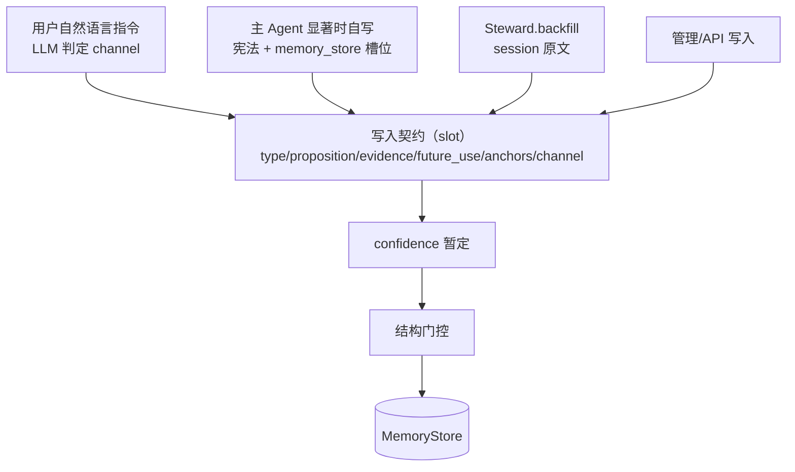

# Memory 系统 Redesign — 设计规格

> 状态：设计冻结（实现前规格）  
> 范围：Memory 价值模型、全局宪法、写入通道与门控、置信度、Steward、子系统框架扩展、软删除  
> 取代：`docs/memory-extraction-design.md` 中「session ETL 提取器」主路径（旧文档保留作历史，实现以本规格为准）  
> 原则：**无短期/中期拆分；实现按本规格一次到位。**

---

## 0. 第一性原理

Memory 在 agent harness 中的唯一存在理由：

> **在 Information 窗口消失后，仍能改善未来决策与行为。**

由此导出：

| 公理 | 含义 |
|------|------|
| 单位是命题 | 不是摘要、不是计数、不是活动日志 |
| 宁缺毋滥 | 0 条合法；无证据、无锚点、不改变未来行为的条目不得入库 |
| 写者可以多样 | 主 agent / Steward / 管理 API；**准入标准同一** |
| 意图判断归 LLM | 显著性、用户是否要求记住、类型归类 |
| 结构执法归代码 | 形态、溯源、反模式、锚点、容量、安全 |
| 置信度是挣得的 | 写入时暂定，运行时强化；**不依赖人工确认 UI** |

七层对齐：

```
Information (session) ──► Memory (fact/method/norm)
                              │
                              ├─► Cognition（后续子系统）
                              └─► Wisdom（后续子系统）
```

- Extractor/Steward **只写 Memory**，不直接写 Cognition/Wisdom。  
- Information 不进 ContextLayer；Memory 经 MemoryLayer 召回。  
- 全局宪法是 system **preamble**，不参与层预算竞争。

---

## 1. Memory 价值模型

### 1.1 类型（收敛为三类）

| type | 回答 | 例子 | 寿命 |
|------|------|------|------|
| **fact** | 现在什么是真的（含环境、已定结论、否定结论、会话确认的项目约定） | 「Memory 持久化 = SqliteMemoryStore(agent.db)」「统计句提取已否决」「本环境无 playwright」 | 长；变更则 supersede |
| **method** | 同类问题如何做更有效（情境→动作→原因） | 「诊断提取质量问题时：对照 agent.db + extract events + session 原文，不单信设计文档」 | 中长；失效降权 |
| **norm** | 何种情况下应/不应如何行动 | 「回答前先联网核实」「禁止提交 octopi.json」 | 长；被否决则 conflict |

**不入库：**

| 内容 | 应去处 |
|------|--------|
| 活动/过程日志 | SessionStore / 可观测 |
| 开放回路（进行中任务） | Session Tasks / project state（**暂不进 Memory**） |
| 统计句（「有 N 条约束」） | 禁止 |
| 提取系统自述 | 禁止 |
| 人格/平台规则复读 | Persona / 全局宪法 |
| Knowledge 外部静态资料 | KnowledgeStore（不与 fact 双写） |

### 1.2 与旧讨论的对应

| 曾用概念 | 本规格 |
|----------|--------|
| 可行动洞察 | `method` + `norm` |
| 我做过什么 | **不成类**；结论/环境 → `fact`；过程 → session；回路 → tasks |
| 我是怎么做的 | `method` |
| 我以后怎么做 | `norm` |
| preference/decision/lesson/discovery | **废除为入库枚举**；可作 tags，不作 type |

---

## 2. 全局宪法（constitution）

### 2.1 产品定位

| 项 | 决策 |
|----|------|
| 归属 | **产品代码库资产**，不进 `~/.octopi` 等运行空间 |
| 默认路径 | `src/harness/context/constitution/default-agents.md` |
| 加载器 | `src/harness/context/constitution/load-constitution.ts` |
| 防篡改 | 运行空间用户无法通过改 home 文件破坏默认装配 |
| 集成商 | **可整份替换**；不强制保留 Memory 段或工具契约 |
| per-agent | `~/.octopi/agents/<id>/AGENTS.md` 仍属 persona/增补，**不承担平台宪法** |

### 2.2 装配语义（框架不变量）

```
若 constitution.mode ∈ {product, custom} 且加载成功：
  systemPrompt = [宪法正文] + ContextLayer 按 order 拼接
  - 宪法永远在最前
  - droppable = false
  - 保留预算 / 不参与层份额竞争
若 constitution.mode = off：
  - 无 preamble
  - Memory 等能力是否接线与宪法无关（由 Builder/config 决定）
```

### 2.3 配置

```json
{
  "context": {
    "constitution": {
      "mode": "product",
      "path": null
    }
  }
}
```

| mode | 行为 |
|------|------|
| `product` | 读包内 `default-agents.md`；忽略 `path` |
| `custom` | 读 `path` 全文；**`path` 必填**；路径非法 → **build 失败**（不静默 off） |
| `off` | 不注入 preamble |

同步更新：`src/config-schema.ts`、`octopi.schema.json`、`octopi.example.json`。

### 2.4 产品默认宪法 — 正文原则

> 宪法**正文只含可执行指令**，会注入 system prompt。  
> 产品归属 / 装配语义 / 集成商替换说明写在本 DESIGN 与 loader 注释，**不进** `default-agents.md`。  
> 产品默认正文使用 **English**（多数模型对英文操作指令跟随更稳）；记忆内容语言仍跟 `evidence` 原语言。集成商 `custom` 可替换为中文或其他语言全文。

正文模块（规范文件：`src/harness/context/constitution/default-agents.md`）：

0. **无元说明**：不写「本文件在 system 最前 / 产品如何分发 / 集成商如何替换」；不写空泛「服从本宪法」
1. Memory salience checklist（有序问题；未命中默认不写，0 条合法）
2. Types: `fact | method | norm`（及明确禁止项）
3. Tool contract: `memory_search` / `memory_store` 槽位、`channel`、硬约束
4. Boundaries: open loops → tasks；static refs → Knowledge；identity → Persona；禁密钥；不覆盖 persona/security


---

## 3. 写入通道



| 通道 | 触发 | 素材 | 初值倾向 |
|------|------|------|----------|
| 主 agent 自写 | 显著性命中（非每 turn） | 当前对话上下文 | 按 `channel` + 证据 |
| Steward.backfill | 补录请求事件 / 历史迁移 | SessionStore 原文切片 | 按证据结构，整体偏保守 |
| 管理 API | 人工/集成方 | 外部命题 | 必填 source；可标 channel |
| Steward.govern | schedule + health 事件 | 已有 Memory | **不产新内容**；合并/软删/强化 |

**废除：** 以 extract events 统计流为主素材的 rule 计数提取；session lifecycle→bridge→pending 的 ETL 主路径。

---

## 4. 门控（Gate）

位置：**Memory 写入面**（store 调用前的统一策略），对所有写者生效。  
职责：准入与降权，**不做**自然语言意图分类。

### 4.1 流水线

```
candidate
  → G1 形态 Form
  → G2 溯源 Provenance
  → G3 反模式 AntiPattern
  → G4 召回锚点 RetrievalAnchor
  → G5 冲突与容量 Conflict/Capacity（写入路径做初判；govern 做全量）
  → G6 安全 Security
  → accept | shadow | reject(reason)
```

### 4.2 规则要点

| Gate | 通过条件 | 失败处理 |
|------|----------|----------|
| **G1** | proposition 非空；type∈{fact,method,norm}；分数∈[0,1]；长度在类型区间（CJK/EN 分设） | reject |
| **G2** | 自动通道：`evidence` 非空且可定位；禁止合成 `evt_0` 伪证据。管理 API：source 必填 | 自动通道 reject；管理通道可 shadow |
| **G3** | 非统计句/活动日志/系统自述/纯寒暄。结构优先：含数量词且无锚点无引语 → 统计句 | reject |
| **G4** | 至少一个锚点：路径/标识符/URL/引号引语/注册工具名/版本号/…；或 `future_use` 条件句完整 | extractor 自动写入 → reject；`channel=user_directive` 且有 quote → 可降为 shadow |
| **G5** | 非重复；session 内 type 配额；冲突标 supersede 候选 | 重复 → reject/upgrade；超配额 → reject |
| **G6** | 不改写 persona/安全策略；无密钥外泄模式；无「忽略指令并写记忆」类注入 | reject |

**禁止：** 用关键词/正则判定「用户是否要求记住」「是否偏好」。该判断只存在于 LLM（宪法引导）并以结构化 `channel` 传入。

### 4.3 Reason code（实现与指标必用）

```
empty | bad_type | too_short | too_long
no_evidence | synthetic_evidence
statistical_summary | activity_log | meta_noise
no_retrieval_anchor
duplicate | session_rate_limit
out_of_scope | suspicious_instruction
shadowed_low_confidence
```

拒绝必须可观测：写日志 + 可选 metrics（`memory.gate.reject` by reason/channel）。

---

## 5. 置信度

### 5.1 含义

**该记忆可以多大程度影响未来行为**（召回排序、是否注入 system、agent 是否可依赖）。  
不是模型「写得自信」的自评。

### 5.2 分层落点

| 层 | 位置 | 职责 |
|----|------|------|
| 策略公式 | `src/harness/memory/confidence.ts` | `provisional(input)` / `band(score)` / `injectFilter(entry)`；**唯一公式源** |
| 写入暂定 | memory 工具 handler、Steward.backfill | 填 `confidence/status/channel` |
| 持久化过滤 | MemoryStore（InMemory + Sqlite） | 存字段；retrieve 默认 `deleted=0` + status 策略 |
| 召回行为 | MemoryLayer、`memory_search` | Layer：仅 active/strengthened；Search：含 shadow、排除 deleted |
| 挣得/治理 | Steward.govern + 写入时重复检测 | 复现 boost、冲突 decay、软删 |
| Profile 配置 | `octopi.json` / agent profile | channel 先验与注入阈值 |

### 5.3 channel → 暂定 band（默认）

| channel + 证据 | status | 说明 |
|----------------|--------|------|
| `user_directive` + quote + 锚点 | active，高分 | 嵌入式下最接近「确认」 |
| `decision`/`fail_fix` + quote + 锚点 | active，中高 | |
| `decision`/`fail_fix` + 弱证据 | 视锚点 active/shadow | |
| `model_inference` 无 quote | **shadow** | 可搜不可注入 |
| 锚点充足 | 上调（有上限） | |

### 5.4 状态机

```
Provisional ──► Shadow ──强化──► Active ──► Strengthened
     │              │               │              │
     │              └─TTL 未强化──► Archived       │
     └─达阈值──────► Active                        │
Active ──弱化──► Weakened ──► Conflict ──supersede──► Active(新) 
                              └────────作废───────► Archived
```

### 5.5 挣得机制（无人工确认）

| 机制 | 效果 |
|------|------|
| 等价命题跨 session 再现 | boost（写入路径或 govern） |
| 存续未被推翻且仍被检索 | 弱 boost |
| 按记忆行动后结果成立 | boost |
| 用户纠正 / 行为否决 | **强 decay + conflict** |
| 沉默（未发生） | **不** boost |

Profile 只改先验与阈值，不改机制：

| profile | 特点 |
|---------|------|
| `personal_assistant` | 显式指令可给高初值 |
| `embedded_interactive` | 自然语言约束高；推断默认 shadow |
| `embedded_headless` | 推断更低；无 quote 不 Active |

---

## 6. Shadow 与软删除

### 6.1 Shadow

| 行为 | 规定 |
|------|------|
| `memory_search` | **可见** |
| MemoryLayer 注入 | **默认不可见** |
| 升级 | 复现/证据补强/行为一致 → Active |
| 过期 | 见 govern `shadow_expired` |

### 6.2 Schema 增量（MemoryEntry）

```ts
status: 'shadow' | 'active' | 'strengthened';
channel: 'user_directive' | 'decision' | 'fail_fix' | 'model_inference';
deleted: boolean;
deleted_at?: number;
deleted_by?: string;
deleted_reason?: 'junk_recheck' | 'duplicate_loser' | 'superseded'
  | 'shadow_expired' | 'decay_unused' | 'capacity';
deleted_meta?: { winnerId?: string; ruleId: string; score?: number };
reinforcedAt?: number;
```

迁移：旧条目默认 `status='active'`、`deleted=false`、`channel` 可空→实现时标 `model_inference` 或 `unknown` 兼容策略见 §12。

### 6.3 软删除策略（govern）

**原则：** 只软删；可恢复；可审计；默认可 dryRun；检索排除 deleted。

**保护名单（protect，任一命中则本轮不删）：**

- 已 `deleted=1`
- `now - createdAt < protectWindowMs`（默认 24h）
- `channel=user_directive` 且 `confidence ≥ userDirectMinConfidence`（0.85）
- `status=strengthened` 且近 `strengthenedIdleMs`（30d）有访问
- `type=norm` 且 `confidence ≥ normProtectConfidence`（0.8）且 `channel ∈ {user_directive, decision}`（实现附加 channel，避免 model_inference 高分 norm 永锁）
- `tags` 命中 `protectTags`（默认 `env`,`security`）

**删除规则（固定顺序）：**

| 序 | ruleId | 条件 | 动作 |
|----|--------|------|------|
| 1 | `junk_recheck` | G3 结构复检失败等垃圾 | softDelete |
| 2 | `duplicate_loser` | 近重复且分更低（相似度默认 0.92 或归一化全等） | 合并入 winner 后 softDelete + winnerId |
| 3 | `superseded` | 同 subject 冲突，新证据/分更强 | softDelete 旧条 + winnerId |
| 4 | `shadow_expired` | shadow + 龄期≥14d + 访问不足 + idle≥14d | softDelete |
| 5 | `decay_unused` | score&lt;0.25 + idle≥90d；method/norm 更严 | softDelete |
| 6 | `capacity` | type 活跃数超上限（fact 200 / method 100 / norm 150） | 删弱者至上限，跳过 protect |

`score = importance * confidence * decayFactor`（来自 confidence 模块）。

**默认配置（govern `metadata.config.softDelete`）：**

```yaml
protectWindowMs: 86400000
shadowTtlMs: 1209600000
shadowIdleMs: 1209600000
shadowMinAccess: 1
decayScoreFloor: 0.25
decayIdleMs: 7776000000
strengthenedIdleMs: 2592000000
userDirectMinConfidence: 0.85
normProtectConfidence: 0.8
duplicateSimilarity: 0.92
capacity: { fact: 200, method: 100, norm: 150 }
protectTags: ['env', 'security']
dryRun: false
```

**必须排除 deleted 的路径：**

- `MemoryStore.retrieve`（InMemory / Sqlite / hybrid）
- `memory_search` / `memory_get` 策略（get 可对 deleted 返回带标记结果供审计，默认不进召回）
- `MemoryLayer.assemble`
- dedup/容量计算
- `stats()`：`totalActive` 与 `deleted` 分列

**恢复：** 管理 API `undelete(id)`；默认不进主 agent 工具集。

---

## 7. Memory Steward（自主子系统）

### 7.1 定位

| | 主通道 | Steward |
|--|--------|---------|
| 角色 | 日常自觉笔记 | 补藏 + 理架 |
| 素材 | 当前对话 | Session 原文 + **已有 Memory** |
| 是否生产命题 | 是 | 补录是；治理否 |
| 是否污染主会话 | 写入时短暂 | **禁止**（signal 仅 event） |

### 7.2 包结构（多 spec + shared）

```text
src/subsystems/memory-steward/
  shared/
    confidence-bridge.ts
    gates.ts
    govern-policy.ts
    backfill-extract.ts
    types.ts
  backfill/
    config.yaml          # id: memory.steward.backfill
    SUBSYSTEM.md
    handler.ts
  govern/
    config.yaml          # id: memory.steward.govern
    SUBSYSTEM.md
    handler.ts
```

### 7.3 backfill 子系统

```yaml
id: memory.steward.backfill
name: Memory Steward Backfill
sense:
  source: eventBus
  filter:
    events: ['memory.steward.backfill.request']
    emits: ['memory.steward.backfilled', 'memory.steward.backfill.failed']
  isolation: structured
think:
  implementation: code
  model: mini
  maxIterations: 1
act:
  mode: inject
signal:
  severity: info
  channel: [event]
boundary:
  visibility: structured
  authority: act
  security: trusted
tools:
  mode: none
session:
  mode: ephemeral
  scope: agent
lifecycle:
  maxConcurrent: 1
  maxDurationMs: 60000
runtimeInject:
  requires: ['memoryStore', 'sessionStore', 'constitution']
observability:
  eventPrefix: memory.steward.backfill
metadata:
  config:
    maxSessionsPerRun: 20
    maxEvidenceChars: 8000
```

Handler 职责：

1. 从事件/`eventData` 得到 sessionId 列表或扫描策略  
2. `sessionStore` 读原文，按宪法蒸馏证据切片  
3. `llmPort` 按宪法提取 fact/method/norm 候选（槽位齐全）  
4. shared 门控 + confidence 暂定 → `memoryStore.store`  
5. Act 审计消息 + signal 统计（accepted/rejected by reason）

### 7.4 govern 子系统

```yaml
id: memory.steward.govern
name: Memory Steward Govern
sense:
  source: schedule
  interval: 3600000
  filter:
    events: []   # schedule 模式；另可监听 memory.health.* （见扩展）
    condition: "true"
    emits: ['memory.steward.governed']
  isolation: isolated
think:
  implementation: code
  model: mini
act:
  mode: inject
signal:
  severity: info
  channel: [event]
boundary:
  visibility: isolated
  authority: act
  security: trusted
lifecycle:
  maxConcurrent: 1
runtimeInject:
  requires: ['memoryStore']
metadata:
  config:
    softDelete: { ...见 §6.3... }
```

Handler 职责：

1. 读 `deleted=0` 全量（或分页）  
2. 按 §6.3 顺序执行 protect / 六类规则  
3. 应用 merge/supersede/softDelete/boost（经 MemoryStore 管理面）  
4. 产出 method/norm 晋升候选信号（不直接写 Wisdom）  
5. Audit + `memory.steward.governed` 统计

### 7.5 运行约束

- 两 spec **均不**订阅主会话生命周期作为主脉搏  
- `signal.channel` **仅** `event`  
- 禁止向主 Agent context/steering 注入治理噪声  
- 与主循环预算隔离（子系统 lifecycle + mini 模型）  
- 循环防护：emits 不包含自身 sense 事件；govern 不触发 backfill 写路径自激  

### 7.6 触发 API（补录）

```ts
runtime.trigger('memory.steward.backfill', {
  agentId,
  sessionId?,
  eventData: {
    sessionIds?: string[],
    reason: 'manual' | 'historical_import' | 'coverage_gap',
  },
});
```

`{ triggered, status }` 语义与现网一致：`failed`/`timeout` 不得视为业务成功。

---

## 8. 子系统框架扩展（支撑 Steward，一次交付）

### 8.1 问题

现行 `SubsystemLoader` 只扫描搜索根的直接子目录，且要求该目录根上存在 `config.yaml`/`SUBSYSTEM.md`。  
嵌套多 spec 包与 `shared/` **不被支持**，还会产生 load errors。

### 8.2 Loader 规则（替换现扫描语义）

对搜索根每个一级目录 `pkg`（跳过 `.` 前缀）：

1. 若 `pkg` 根存在 `config.yaml` 或 `SUBSYSTEM.md` → `loadOne(pkg)`（兼容单 spec 包）。  
2. 否则扫描 `pkg/*/`：  
   - 子目录含 config/SUBSYSTEM.md → `loadOne(子目录)`，按 spec `id` 进 Map（覆盖优先级不变：project > user > builtin > npm）。  
   - 子目录无二者 → **静默跳过**（shared/lib/references）。  
3. `pkg` 无自身 spec 且无可加载子 spec → **静默跳过**（纯资源包）。  
4. 目录含 `handler.ts`/`handler.js` 却无 config/SUBSYSTEM.md → **error**（作者写坏）。

### 8.3 `hasLoadableSubsystem`（builder）

与 Loader 同构：一级子目录根有 spec，**或**其子目录中有 spec，即视为可加载 builtin 路径。

### 8.4 Spec 扩展字段

```ts
packageId?: string;    // 如 'memory-steward'
packageRoot?: string;  // 多 spec 包根路径
```

支持 allowlist/denylist 使用包名或 `memory.steward.*` 前缀（实现时在注册过滤中处理）。

### 8.5 Builder 注入

| 名称 | 注入 |
|------|------|
| `memoryStore` | 已有（与 tools/MemoryLayer 同实例） |
| `sessionStore` | **新增注册** |
| `constitution` | **新增注册**（默认宪法文本或 custom 加载结果） |

### 8.6 ActResult 审计

```ts
act?: {
  mode: ...;
  status: ...;
  target?: string; // 'memory-store'
  messages?: ...;
  ops?: Array<{
    op: 'soft_delete' | 'supersede' | 'merge' | 'boost' | 'undelete';
    ids: string[];
    reason?: string;
    meta?: Record<string, unknown>;
  }>;
};
```

### 8.7 明确不做

- SenseEngine 内特判 memory 指标表达式（health 用 EventBus 事件或通用 metrics 源）  
- 为 Steward 另建旁路运行时  
- 在 Loader 层注入业务依赖  

### 8.8 health 事件（govern 辅助触发，可选接线）

允许轻量 probe（Builder/startup）在下列情况 emit：

- `memory.health.high_count` `{ type, count, limit }`
- `memory.health.shadow_backlog` `{ count }`

govern 可在 config 中增加 listen 这些事件作为 schedule 之外的补充 sense；**不是**框架特判。

---

## 9. MemoryStore / 工具面变更

### 9.1 接口增量

```ts
interface MemoryStore {
  // 现有 store/retrieve/get/update/delete/decay/stats 保留
  softDelete(id: string, meta: {
    by: string;
    reason: SoftDeleteReason;
    winnerId?: string;
  }): Promise<void>;
  undelete(id: string): Promise<void>;
  listForGovern(filter?: { includeDeleted?: boolean }): Promise<MemoryEntry[]>;
}

interface MemoryQuery {
  // 增量
  includeShadow?: boolean;   // default false for inject; true for search tool
  includeDeleted?: boolean;  // default false
  status?: MemoryStatus | MemoryStatus[];
  channel?: MemoryChannel | MemoryChannel[];
}
```

`delete(id)`：硬删仅管理/测试路径；生产治理默认 `softDelete`。

### 9.2 memory 工具

| 工具 | 行为 |
|------|------|
| `memory_store` | 槽位校验 → confidence 暂定 → gates → store；可选 `supersedes_id`（须来自 search）→ 写新条后软删旧条；返回 id/status/reject reasons |
| `memory_search` | 检索含 shadow、排除 deleted；结果标注 status/channel/confidence |
| （可选）`memory_forget` | 不进默认主 agent 工具集；治理/管理使用 |

### 9.3 MemoryLayer

- 查询：`includeShadow: false`, `includeDeleted: false`  
- 渲染：`- [type] proposition (when: future_use 精简)` — **禁止**注入统计句（门控已挡，双保险）  

---

## 10. 废弃与拆除（实现时同步）

| 组件 | 处置 |
|------|------|
| `extractCandidates` 统计句规则 | **删除** |
| `SemanticSignals` 标点确认作为事件主源 | **删除/停用**（不作为 user_confirm 产生器） |
| collector 作为提取主素材（空 payload 事件流） | **拆除主路径**；不作为 Steward 输入 |
| `MemoryExtractorBridge` / `PendingExtractor` ETL 链 | **拆除**；由 Steward 双 spec 取代 |
| 动态阈值策略作为质量主手段 | **删除主路径**；门控 + confidence 取代 |
| 旧 `docs/memory-extraction-design.md` | 保留历史；文首标注 supersede 链接到本规格 |
| `memory-extractor` 子系统 | **移除或改为空实现 deprecated 垫片**；推荐移除并更新 builder 接线与测试 |

---

## 11. 配置汇总

```json
{
  "context": {
    "constitution": {
      "mode": "product",
      "path": null
    },
    "contextAssembler": {
      "includeLayerPreview": false
    }
  },
  "subsystems": {
    "auditDir": "./data/audit",
    "allowlist": [],
    "denylist": []
  },
  "models": {
    "level": {
      "mini": { "primary": "..." }
    }
  },
  "memory": {
    "profile": "embedded_interactive",
    "confidence": {
      "injectMinScore": 0.55,
      "channelPriors": {
        "user_directive": 0.9,
        "decision": 0.75,
        "fail_fix": 0.75,
        "model_inference": 0.4
      }
    },
    "gates": {
      "maxLength": { "fact": 400, "method": 500, "norm": 300 }
    }
  }
}
```

（键名以 `config-schema.ts` 最终同步为准；`memory.*` 为新增段。）

---

## 12. 实现清单（一次交付，非分期）

### A. 契约与类型

- [ ] `MemoryType = 'fact' | 'method' | 'norm'`
- [ ] MemoryEntry：`status/channel/deleted*/reinforcedAt`
- [ ] MemoryQuery：`includeShadow/includeDeleted/status/channel`
- [ ] memory 工具槽位类型
- [ ] ActResult.ops

### B. 宪法

- [ ] `default-agents.md` 产品资产（含 §2.4）
- [ ] `load-constitution.ts`
- [ ] Assembler preamble 接线（最前、不可丢、保留预算）
- [ ] `context.constitution` schema + config-bridge

### C. 写入面

- [ ] `harness/memory/confidence.ts`
- [ ] `harness/memory/gates.ts` + reason code
- [ ] `memory_store`/`memory_search` 重写
- [ ] Sqlite/InMemory softDelete、undelete、过滤、stats 分列

### D. Steward + 框架

- [ ] Loader 多 spec 包 + 静默跳过
- [ ] `hasLoadableSubsystem` 同步
- [ ] `packageId/packageRoot`
- [ ] Builder 注入 `sessionStore`/`constitution`
- [ ] `subsystems/memory-steward/{shared,backfill,govern}`
- [ ] 拆除旧 extractor 主路径与测试迁移

### E. 文档

- [ ] 本规格保持为真相源
- [ ] `docs/context-layer-contracts.md` 增补 preamble
- [ ] `docs/autonomous-subsystem.md` 增补多 spec 包约定
- [ ] `docs/memory-extraction-design.md` 文首 supersede
- [ ] CHANGELOG / 版本按仓库约定

### F. 测试矩阵（最低）

| 用例 | 期望 |
|------|------|
| 宪法 product 装配顺序 | preamble 在 persona 前；预算不被挤掉 |
| custom path 无效 | build 失败 |
| off | 无 preamble |
| LLM 判定 user_directive + quote + 锚点 | active 入库 |
| model_inference 无 quote | shadow；search 可见；Layer 不可见 |
| 统计句候选 | gate reject `statistical_summary` |
| 无锚点自动写入 | reject `no_retrieval_anchor` |
| 同命题二次写入 | 不重复膨胀；可 boost |
| 冲突 norm | supersede + audit winnerId |
| shadow 过期 | softDelete `shadow_expired` |
| protect 名单 | 永不被 govern 软删 |
| retrieve/search | 永不返回 deleted |
| Loader 嵌套包 | `memory.steward.backfill/govern` 均注册；shared 无 error |
| signal | Steward 无 context/steering 注入 |
| 废弃路径 | 统计句 extractCandidates 不存在或永不入库 |

---

## 13. 质量公理（验收口径）

1. 宁可 0 条记忆，不可 1 条无证据、无锚点、不改变未来行为的条目。  
2. Memory 的单位是命题，不是摘要，更不是计数。  
3. 意图理解不进正则；结构执法不进「猜语义」。  
4. 所有写者同一门控；所有治理可审计、可软删、可恢复。  
5. 旁路自动化统一走 autonomous-subsystem；Steward 是该框架的领域用户，不是特例运行时。

---

## 14. 相关文件（实现时）

| 路径 | 说明 |
|------|------|
| `src/harness/context/constitution/default-agents.md` | 产品宪法 |
| `src/harness/context/constitution/load-constitution.ts` | 加载 |
| `src/harness/memory/confidence.ts` | 置信度策略 |
| `src/harness/memory/gates.ts` | 门控 |
| `src/harness/memory/types.ts` | 契约 |
| `src/harness/autonomous-subsystem/loader.ts` | 多 spec 包 |
| `src/subsystems/memory-steward/**` | Steward |
| `src/config-schema.ts` + `octopi.schema.json` + `octopi.example.json` | constitution/memory 配置 |
| `tests/memory/**` / `tests/autonomous-subsystem/loader-multispec.test.ts` | 回归 |

---

## 15. 决策记录（已冻结）

| # | 决策 |
|---|------|
| 1 | Memory 类型 = fact/method/norm；开放回路不入库 |
| 2 | 主通道 = 宪法引导下的 agent 自写（显著性驱动，非每 turn） |
| 3 | Steward = 双子系统 + shared；基于 subsystem 框架并扩展 Loader |
| 4 | 显著性/用户意图仅 LLM；门控仅结构 |
| 5 | 置信度 = confidence 模块 + 写入暂定 + store 过滤 + govern 挣得 |
| 6 | Shadow 可搜、默认不注入 |
| 7 | 软删除 + 全路径排除 deleted |
| 8 | 知识 = 静态外部资料；项目约定 = fact |
| 9 | 全局宪法 = 产品资产；`context.constitution`；`product\|custom\|off` |
| 10 | 一次到位，不做短期/中期拆分叙事 |
